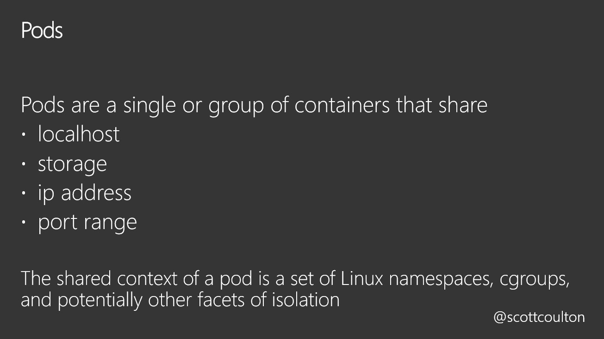
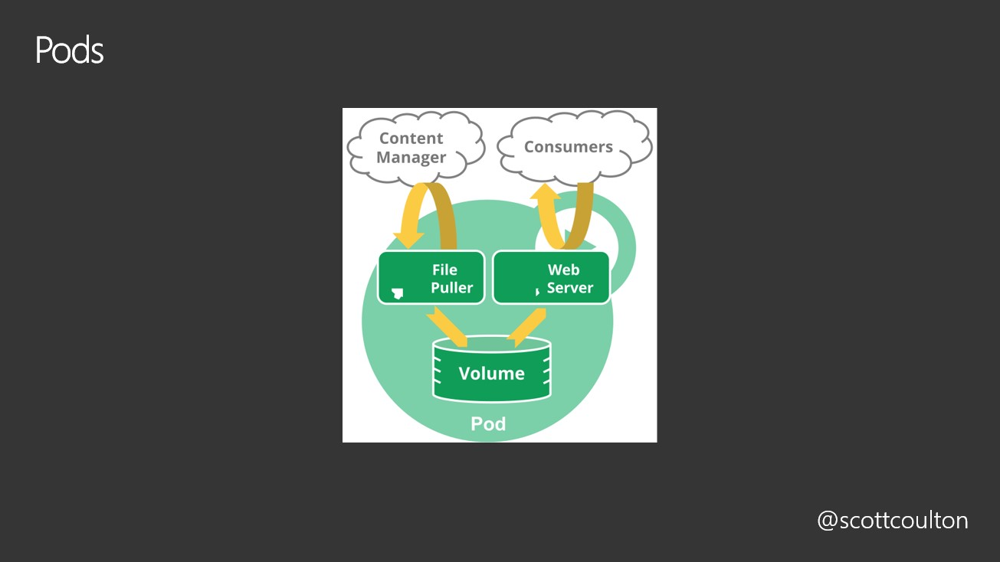
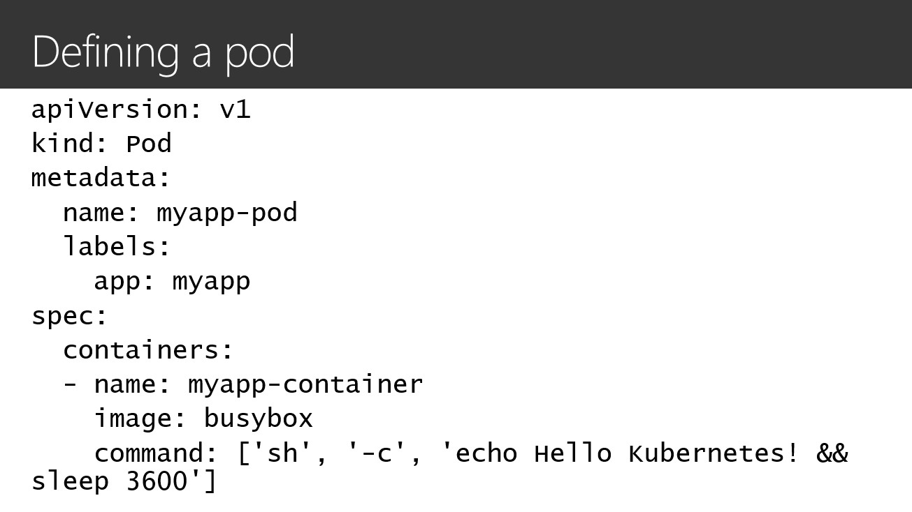
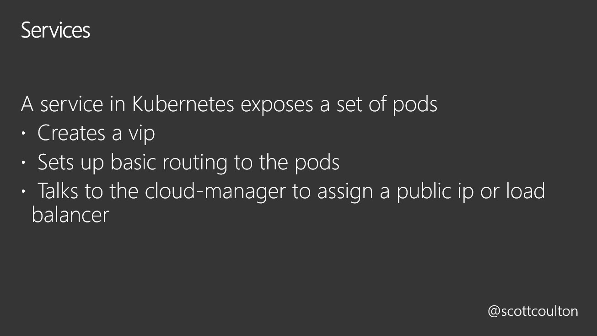
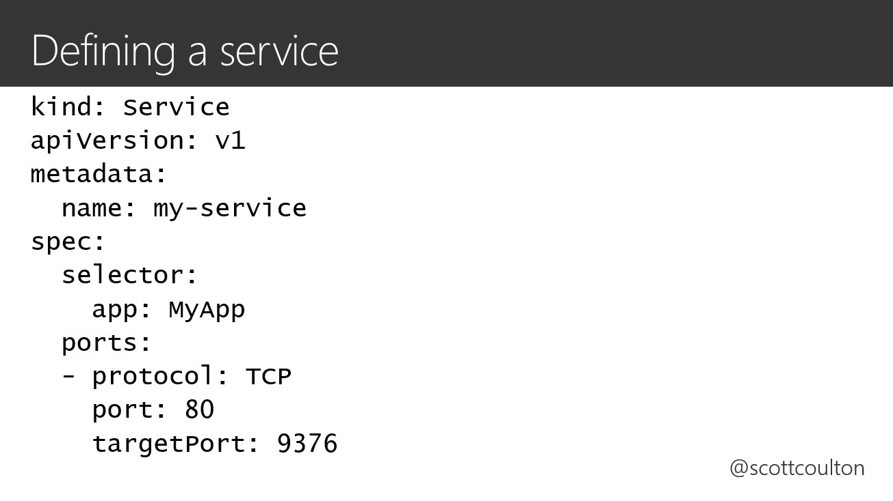
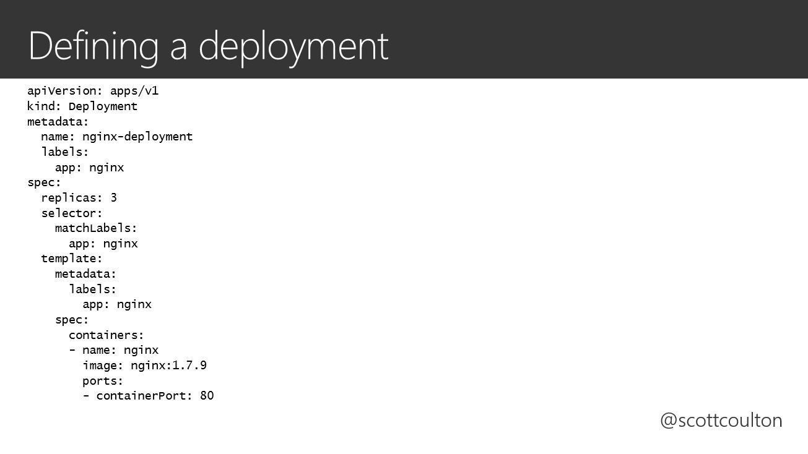
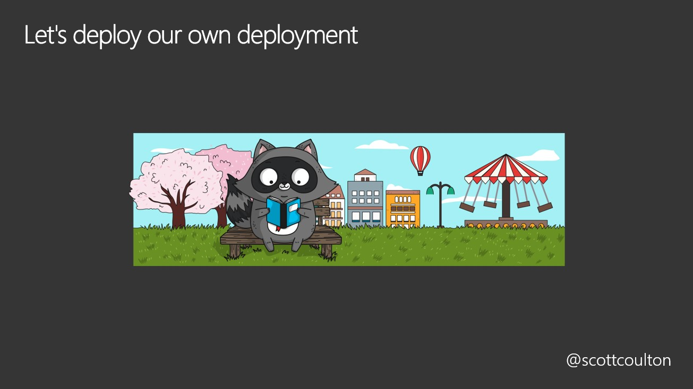
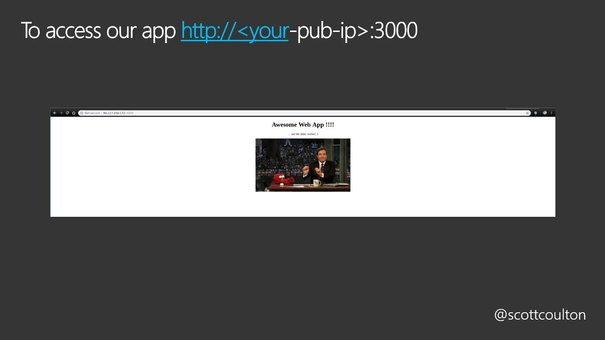

# Pods, services and deployments












## Our Deployment
```
cat <<EOF | kubectl apply -f -
apiVersion: apps/v1 
kind: Deployment
metadata:
  name: webapp-deployment
spec:
  selector:
    matchLabels:
      app: webapp
  replicas: 3
  template:
    metadata:
      labels:
        app: webapp
    spec:
      containers:
      - name: webapp
        image: scottyc/webapp:latest
        ports:
        - containerPort: 3000
          hostPort: 3000
EOF
```

## Now check our deployment

```
kubectl get deployments
kubectl get pods
kubectl get services
```


## Expose our service
`kubectl expose deployment webapp-deployment --type=LoadBalancer`  
`kubectl get service`


`kubectl get service` will give you the public ip address for the application. It will then be available  



Now we move onto the next module [here](../rbac-roles-service-accounts/code.md)